# FinPilot V2

FinPilot is an AI-powered financial learning and information navigation platform designed for university students and financial beginners.

**FinPilot 是一个面向大学生与金融初学者的 AI 金融理解工作台。**

V2 connects your learning evidence, knowledge routes, real-world sources and contextual AI into one workspace.

本页对应 `v2` 分支；[main 保留 V1](https://github.com/zxy6688/FinPilot/tree/main)。V2 已完成本地产品实现与回归，尚未部署服务器。


> 看懂金融，形成自己的判断。

从一条可信资料出发，理解概念之间的联系，再通过课程、自测、实验和讨论检验理解。FinPilot 用 Topic 连接信息与学习过程，让“看过”逐步变成能够解释、提问和反思。

**发现信息 → 理解概念 → 系统学习 → 交互实验 → 社区讨论 → 学习反思**

[产品体验](#core-experience) · [知识架构](#knowledge-architecture) · [快速开始](#quick-start) · [V2 验收](docs/V2_ACCEPTANCE.md)

### Product Preview

以下为实际 V2 页面，使用独立本地数据库中的体验账户。示例学习活动用于展示产品行为，不代表真实用户表现；新注册账户从空白学习记录开始。

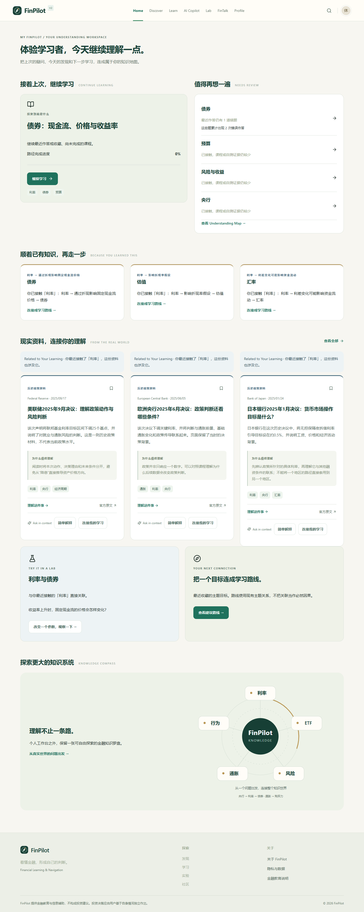

| Understanding Map                                                      | Learning Route                                                        |
| ---------------------------------------------------------------------- | --------------------------------------------------------------------- |
| 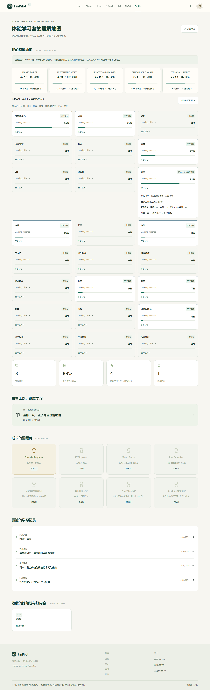 | 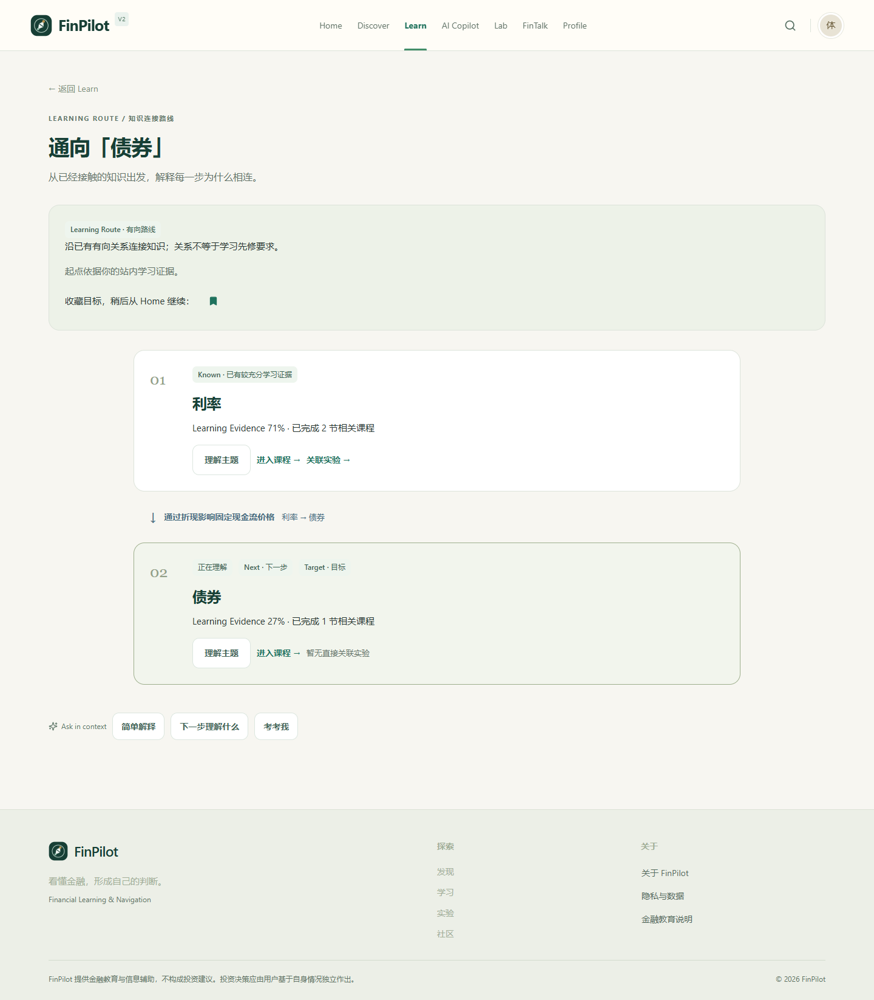 |

| Contextual AI                                                      | Real World Connections                                               |
| ------------------------------------------------------------------ | -------------------------------------------------------------------- |
| 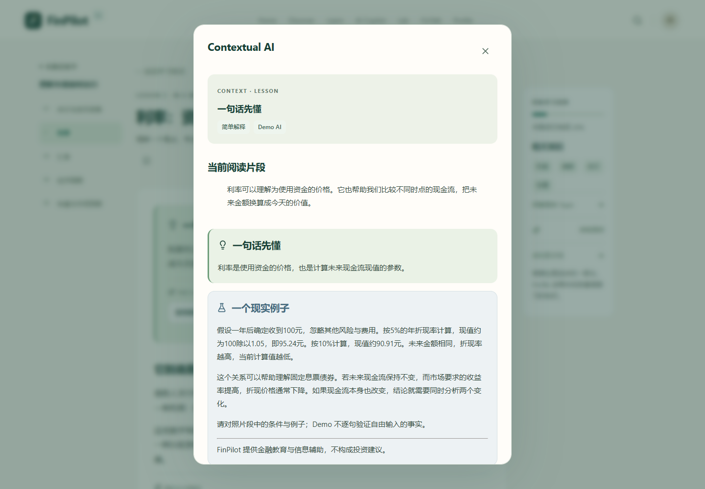 | 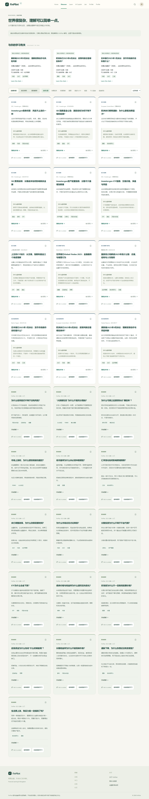 |

<details>
<summary>Topic · Scenario Lab · Mobile</summary>

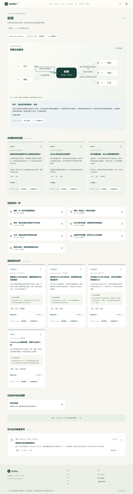
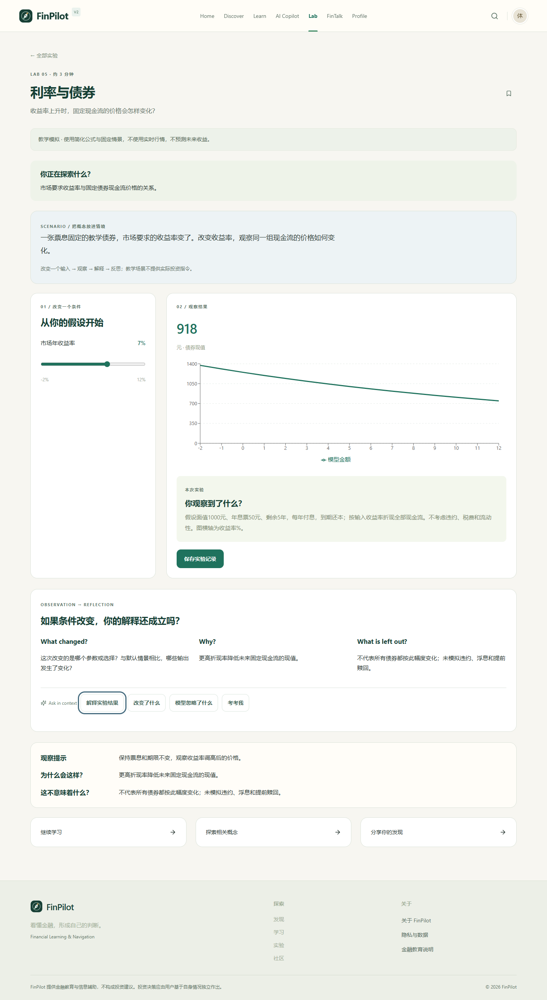

| Mobile Home                                           | Mobile Route                                                      | Mobile AI                                              |
| ----------------------------------------------------- | ----------------------------------------------------------------- | ------------------------------------------------------ |
| 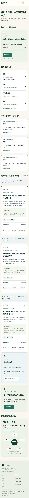 | 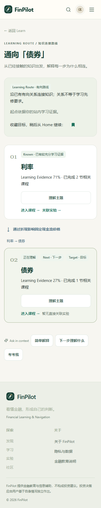 | 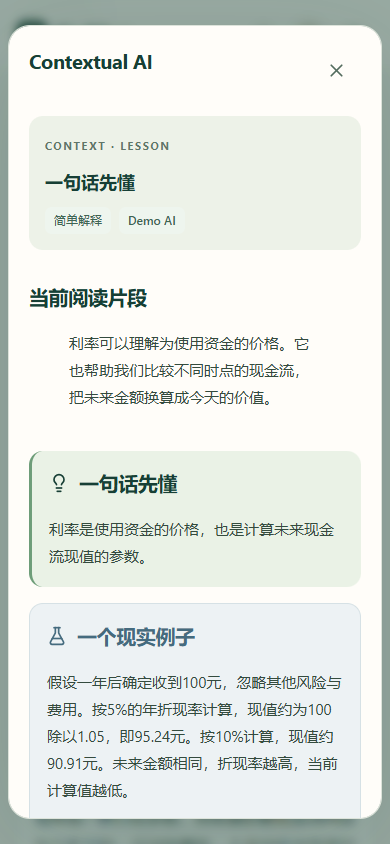 |

</details>

全部 11 张截图见 [V2 截图目录](docs/screenshots/v2/)；下载仓库后可打开 [HTML 图集](docs/screenshots/v2/index.html)。

## Why FinPilot?

### Financial information is fragmented

政策、新闻、产品、指标与术语常常分散出现。初学者需要的不只是更多链接，还需要知道信息来自哪里、涉及什么概念、应该从哪一步开始理解。

### Knowing a definition is not understanding

知道 ETF 的定义，不等于理解它与指数、分散风险、资产配置的联系。课程中的例子、适用条件和误区辨析，帮助用户检查概念的边界。

### Learning and decision-making are disconnected

阅读与记忆之外，还需要改变假设、观察结果、解释分歧。FinPilot 把真实资料、关系图、AI 解释和实验放进同一学习过程，为金融素养教育与学习交互研究提供可观察的产品实例；目前没有学习效果提升的实证结论。

**FinPilot focuses on understanding before action.**

## Product Philosophy

- **Understand before acting**：先理解机制、条件与风险，再形成判断。
- **Explain, don't decide**：AI 帮助解释、连接和反思，决策权始终属于用户。
- **Learning as a connected system**：主题、资料、课程、自测、实验与讨论共享内容关联，回答之后还有可继续学习的入口。

## Learning Journey

下面表示可组合的学习流程，而非强制逐页完成的路线。实验后的反思可进入讨论；Profile 汇总站内活动。

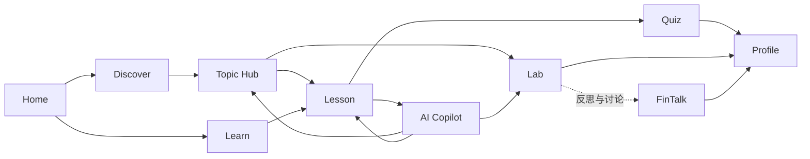

## Core Experience

### My FinPilot — Your Understanding Workspace

Home 根据本人完课、自测、浏览、收藏和实验记录，呈现继续学习、待复习主题、带关系说明的下一主题、相关真实资料与实验。首次访问提供明确的新手入口；知识罗盘保留自由探索。推荐顺序确定且可解释，不随机分配。

### Discover — From Information to Understanding

`REAL_WORLD` 展示官方或真实来源资料，保留出处、日期与原文链接；`EXPLAINER` 提供原创解释。目录包含历史材料，不作为实时新闻流。主题标签把阅读引向知识关系和后续学习。V2 的 **Real World Connections** 从已有真实资料中说明为什么与你的学习有关、涉及哪些主题、哪些已有证据及哪些值得继续探索。没有匹配时不伪造个人关联。

### Topic Hub — Connected Financial Knowledge

Topic 是产品的核心连接层。有向关系图展示概念之间的方向和关系说明，并聚合相关文章、课程、实验、讨论与 AI 入口。桌面支持节点跳转、关系选择和键盘操作，移动端提供可读的关联视图，帮助用户从一个名词追问它与其他知识的联系。

### Learn — Structured Learning Paths

五条路径把零散问题组织成可推进的学习旅程，展示当前课程与完成进度：

| 路径                                            | 学习方向                       |
| ----------------------------------------------- | ------------------------------ |
| Money Basics · 第一次理解钱与金融               | 购买力、机会成本与基础金融概念 |
| Personal Finance · 管理好自己的钱               | 预算、应急金、债务与时间期限   |
| Investment Basics · 投资到底是什么              | 股票、债券、基金、分散与费用   |
| Understand Markets · 理解市场如何运行           | 央行、利率、通胀与经济周期     |
| Behavioral Finance · 为什么我们会做出非理性决策 | 从众、确认偏误与判断过程       |

### Learning Routes — From What You Know to What You Want to Understand

在 Learn 选择目标，或从 Topic、Profile、Search 进入路线。服务优先沿真实有向边连接已有学习证据与目标，逐步显示 Known / Next / Target、关系标签和课程/实验入口。需要逆向探索时明确标为 Connection Route，不暗示反向因果；无路线时诚实回到目标主题。收藏目标后可从 Home 继续。

### Lesson — From Reading to Interaction

章节目录配合结构化阅读，呈现概念、生活例子、风险边界和误解辨析。嵌入自测提供答案解释，完成记录回到路径与 Profile；相关主题、AI 提问和下一课让阅读继续延伸。

### Contextual AI & AI Copilot

课程段落、主题关系、Discover、Lab 和路线均可原地解释、举例、连接学习或自测。弹窗显示当前来源与实际 Demo / External 状态，支持键盘与追问；实验解释使用当前参数在后端重算的结果。保存的上下文会话也可在完整 Copilot 中继续。

**Tutor / Explain / Guide / Behavior Coach** 分别用于概念讲解、文字解读、学习顺序和行为反思。会话保留历史，回答附带“继续理解、加入学习、去实践”入口，连接实际 Topic、Lesson 与 Lab。无需 API Key 即可使用明确标识的 Demo AI，外部模型为可选适配。

**AI Copilot supports understanding, not financial decision automation.**

### Interactive Labs

实验以 **inputs → model → chart → observation → explanation** 组织体验；情景选择型实验同时提供反馈。参数和情景用于观察假设的影响，不代表市场预测。V2 为八个原有模型补充各自的 Scenario、Observation、Reflection 和上下文 AI，公式保持不变。

| 实验                               | 观察重点                     |
| ---------------------------------- | ---------------------------- |
| 复利的时间力量 · Compound Interest | 本金、时间与复利累积         |
| 看不见的购买力 · Inflation         | 名义金额与实际购买力         |
| 波动与收益 · Risk & Return         | 收益路径与波动               |
| 你的资产拼图 · Asset Allocation    | 配置比例与组合特征           |
| 利率与债券 · Interest Rate         | 利率变化与债券价格           |
| 错过的焦虑 · FOMO Challenge        | 群体信息与追涨冲动           |
| 面对损失 · Loss Aversion           | 损失情景中的选择与反思       |
| 如果市场下跌20% · Market Crash     | 下跌情景、承受能力与应对思路 |

### FinTalk

围绕主题发帖、回复、点赞、收藏、查看讨论摘要或举报内容，把个人困惑变成可交流的问题。初始帖子和互动由 **fictional seed personas** 提供，明确属于虚构学习示例，不冒充真实社区。

### Understanding Map — Learning Evidence

Profile 展示五条学习路径领域和 24 个主题的四种证据状态，分项可展开查看完课、自测、实验及接触记录。默认权重 40 / 35 / 15 / 10；主题没有某类内容时重新归一化，避免因无 Lab 而扣分。最新仍错的题优先进入复习，改对后更新。

这些是 **Learning Evidence，不是金融或投资能力测量**。徽章、近期活动和收藏继续保留。全局 Search 追加学习路线结果，继续支持 Ctrl/Cmd K、方向键、Enter 和 Esc。

## Content at a Glance

以下为当前 JSON 内容目录及示例互动定义的规模，不包含用户后续新增内容。

| Content Layer                               | Scale |
| ------------------------------------------- | ----: |
| Topics                                      |    24 |
| Directed Topic Relations                    |    32 |
| Real-world / official-source Discover items |    12 |
| Explainers                                  |    16 |
| Learning Paths                              |     5 |
| Lessons                                     |    28 |
| Quiz Questions                              |    64 |
| Interactive Labs                            |     8 |
| Fictional Community Personas                |     8 |
| Example Posts                               |    20 |
| Example Comments                            |    20 |

主题关系、课程关联和相关内容入口把这些内容连接起来；来源核验记录见 [source-audit.json](content/source-audit.json)。

## Knowledge Architecture

**Topic is the connective layer of the product.** Article 与 Lesson 有主主题及多主题 ID；路径组织课程，课程承载题目，Lab 关联主题和课程，Post 按主题展开讨论。

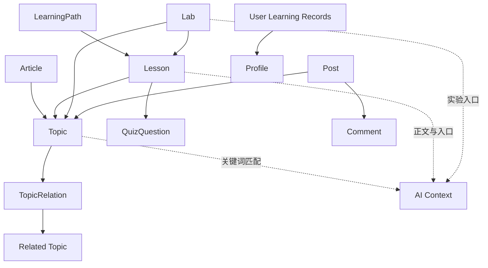

图中实线概括内容关联，虚线表示运行时组装。AI Context 与 Profile 是逻辑视图，不是额外数据库表；多主题 ID 使用 JSON 字段，并非独立图数据库。

## AI Copilot Architecture

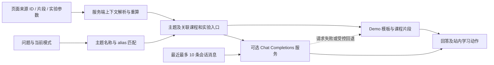

**Demo Mode** 从课程片段与模式模板生成解释，支持主题别名。未匹配到概念时请求补充信息；仅提供 URL 时不会自动抓取网页。它不伪装成实时模型调用。

**External Model Mode** 在同时配置 `LLM_API_KEY` 和 `LLM_MODEL` 时，经 `LLM_BASE_URL` 调用兼容 Chat Completions 的服务。请求包含模式指令、匹配课程正文、可用动作和近期会话；不限定某一家厂商。失败时标记 Demo fallback。

普通对话保留关键词匹配；页面上下文请求按来源 ID 加载真实内容、相关计数与实际图关系，实验结果由后端重算。仅发送所需材料，不上传完整用户档案。没有向量检索或多 Agent 调度；Demo 使用模板，不能自由理解所有追问。确定性的个人学习路线由独立服务计算，详见 [V2 架构](docs/V2_ARCHITECTURE.md)。

## System Architecture

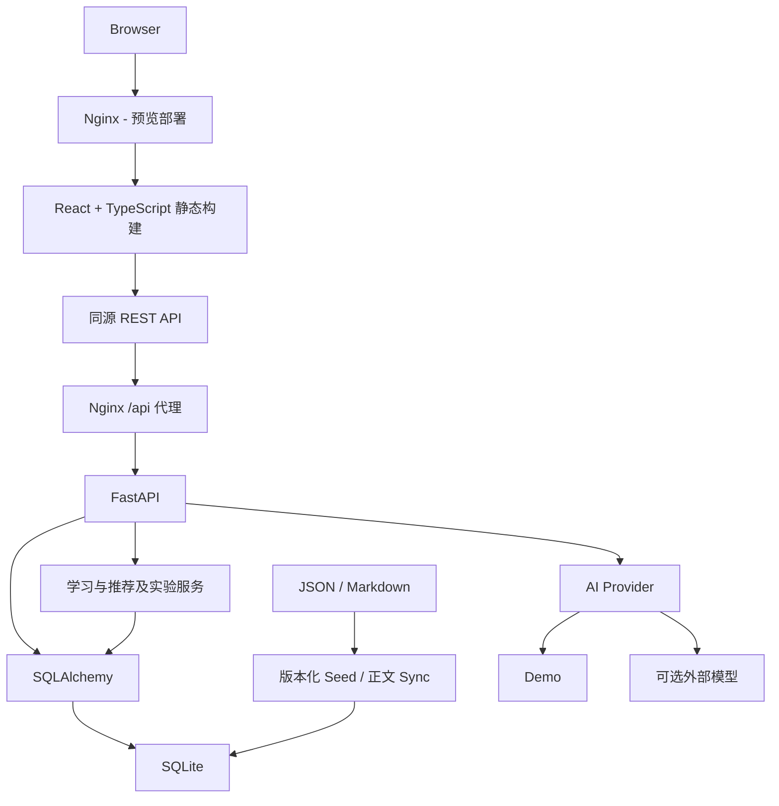

本地开发由 Vite 提供前端并代理 `/api`；服务器方案使用静态构建与 systemd 后端。内容文件是可维护的来源，SQLite 同时保存导入内容与用户活动。

## Tech Stack

| 层级              | 当前技术                                                                    |
| ----------------- | --------------------------------------------------------------------------- |
| Frontend          | React 19、TypeScript、Vite、React Router、Recharts、react-markdown、Lucide  |
| Backend           | Python、FastAPI、Uvicorn、SQLAlchemy、Pydantic、PyJWT、httpx、python-dotenv |
| Storage           | SQLite；JSON / Markdown 内容文件                                            |
| Quality           | pytest、Playwright、TypeScript typecheck、API smoke 脚本                    |
| Deployment assets | Linux、Bash、Nginx、systemd                                                 |

具体依赖以 [package.json](frontend/package.json)、[requirements](backend/requirements.txt) 和对应锁定文件为准。

## Engineering Highlights

- **Safe local runtime**：项目内 venv 与缓存；启动检查端口、服务身份和健康状态，停止时核对 PID 与创建时间。
- **Content synchronization**：版本化 seed 保留用户记录；正文 sync 单独更新 Markdown，JSON 变更需配合导入版本管理。
- **Safe demo reset**：先 SQLite 备份，再清理体验账户；保留其他账户及其对体验帖的互动上下文。
- **Source release hygiene**：环境、数据库、JWT 文件、日志和缓存排除提交；发布前检查实际暂存文件和凭据模式。
- **Isolated preview deployment**：静态发布与回环 API 分离，使用独立服务、目录和数据；失败恢复只处理新版预览。

## Testing & Quality

V2 本地验证同时保留 V1 回归，结果见 [V2_ACCEPTANCE](docs/V2_ACCEPTANCE.md)。

| 验证范围                    | 已通过结果                                                                          |
| --------------------------- | ----------------------------------------------------------------------------------- |
| Backend                     | 42 项：V1 29 项 + V2 13 项                                                          |
| Python / TypeScript / Build | 编译、导入、typecheck、production build                                             |
| API smoke                   | [29 个请求](docs/v2-api-check.json)，含六类上下文来源                               |
| Browser                     | [12 组流程](docs/v2-browser-check.json)，无页面异常；1440、375、390、430、768px     |
| V1 database compatibility   | [只读备份副本检查](docs/v2-compatibility-check.json)：23 张表、289 行保持；无新增表 |

验收使用 Windows Chrome；真实外部模型连接、服务器部署与公网可用性未作为通过结论。原依赖存在一条 Starlette/httpx 测试弃用提示，测试通过；没有为消除提示升级依赖。仓库没有单独 lint 命令。

## Project Structure

```text
FinPilot/
├── backend/                        # API、业务服务与数据持久化
│   ├── app/
│   │   ├── api/routes.py            # REST 路由
│   │   ├── ai/provider.py           # Demo 与外部模型适配
│   │   ├── services/               # 学习足迹、推荐与实验计算
│   │   ├── models.py / schemas.py  # ORM 模型与请求校验
│   │   ├── db.py / security.py     # 数据连接与认证
│   │   ├── seed.py                 # 版本化初始化
│   │   ├── content_release.py      # 内容编辑版本
│   │   ├── reset_demo.py           # 体验账户重置
│   │   └── main.py                 # 应用入口与日志
│   ├── tests/                      # 内容、核心行为及发布测试
│   └── requirements*.txt           # 依赖与锁定清单
├── frontend/                       # React 客户端
│   ├── src/
│   │   ├── components/             # 罗盘、关系图、阅读块、搜索等
│   │   ├── pages/                  # 学习、AI、实验、社区等页面
│   │   ├── services/               # API 请求与认证状态
│   │   └── main.tsx                # 路由与应用入口
│   ├── public/favicon.svg          # 品牌图标
│   └── package.json / vite.config.ts
├── content/                        # 可编辑知识与示例资料
│   ├── lessons/                    # 28 篇 Markdown 正文
│   ├── catalog.json                # 主题、有向关系、路径
│   ├── articles.json / source-audit.json
│   ├── lessons.json / quizzes.json
│   ├── labs.json / topic-aliases.json
│   └── community*.json             # 虚构身份、讨论与互动
├── deploy/                         # 并行预览脚本与服务模板
├── docs/                           # 验收报告、发布记录与截图
│   └── screenshots/v2/             # V2 真实桌面与移动端截图
├── scripts/                        # 本地运行、检查、同步与打包
├── data/                           # 运行时生成，数据库不入 Git
├── .env.example                    # 不含真实密钥的配置示例
├── Setup-FinPilot.cmd               # Windows 安装入口
├── Start-FinPilot.cmd / Stop-FinPilot.cmd
├── Reset-Demo.cmd
└── README.md
```

## Data Model

[SQLAlchemy 模型](backend/app/models.py) 将内容、活动和身份分开组织：

| 模型组                                | 职责                                             |
| ------------------------------------- | ------------------------------------------------ |
| User / RevokedToken                   | 账户、虚构身份标记与已注销令牌                   |
| Topic / TopicRelation / Article       | 主题、带标签的有向关系与资料                     |
| LearningPath / Lesson / QuizQuestion  | 路径顺序、课程正文与题目                         |
| UserProgress / QuizRecord / TopicView | 完课、作答与浏览记录                             |
| Lab / LabRecord                       | 实验定义、输入与结果                             |
| Post / Comment / Like / Report        | 主题讨论、回复、点赞与举报                       |
| Favorite                              | 以 kind + target_id 标识不同类型收藏，非跨表外键 |
| Badge / UserBadge                     | 徽章定义及获得记录                               |
| ChatSession / ChatMessage             | 分模式会话、消息及响应元数据                     |
| ContentRevision                       | 已应用的内容版本                                 |

## Quick Start

准备 **Python 3.10+、Node.js 20+**，克隆 `v2` 分支到独立可写目录，避免覆盖 V1：

```powershell
git clone --branch v2 https://github.com/zxy6688/FinPilot.git finpilot-v2
cd finpilot-v2
```

Windows 入口会按脚本位置定位项目。首次安装需要联网。

1. 双击 `Setup-FinPilot.cmd`，安装锁定依赖并初始化内容。
2. 双击 `Start-FinPilot.cmd`，就绪后自动打开 `http://127.0.0.1:5174`。
3. 登录页点击“填入体验账户”，再点击“登录”：`demo@finpilot.app` / `demo123456`。
4. 用完双击 `Stop-FinPilot.cmd`；以后只需 Start。移动已安装目录后应重新 Setup。

在项目根目录打开 PowerShell，等价命令为：

```powershell
powershell -NoProfile -ExecutionPolicy Bypass -File .\scripts\Setup-FinPilot.ps1
powershell -NoProfile -ExecutionPolicy Bypass -File .\scripts\Start-FinPilot.ps1
# 使用结束后
powershell -NoProfile -ExecutionPolicy Bypass -File .\scripts\Stop-FinPilot.ps1
```

ExecutionPolicy 仅对当前脚本进程生效。本地端口为 5174 / 8002；`-NoBrowser` 可用于 Start 脚本。`Reset-Demo.cmd` 须先 Stop，并输入 RESET 确认；它先备份再清理体验数据。V2 独立使用本目录的数据与运行状态。需要截图中的体验学习记录，可运行 [可选示例脚本](docs/V2_PRODUCT.md#本地体验与样例)；已有学习数据不会被覆盖。旧 [本地发布说明](docs/LOCAL_RELEASE.md) 是 V1 历史文档，端口以此处为准。

## Configuration

以 [.env.example](.env.example) 为准，复制为 `.env` 后按需填写；修改后重启后端。

| Variable     | Purpose                                        | Required                                 |
| ------------ | ---------------------------------------------- | ---------------------------------------- |
| DATABASE_URL | SQLite 位置，默认 `sqlite:///data/finpilot.db` | 本地有默认值                             |
| JWT_SECRET   | JWT 签名密钥                                   | 本地可自动生成；服务器脚本要求独立随机值 |
| LLM_API_KEY  | 外部模型认证                                   | 仅外部模式需要                           |
| LLM_MODEL    | 外部模型名称                                   | 与 Key 同时配置                          |
| LLM_BASE_URL | Chat Completions 服务基础地址                  | 外部模式按服务设置，示例有默认值         |
| CORS_ORIGINS | 逗号分隔的允许来源                             | 本地默认；跨源环境需调整                 |

没有 `AI_MODE` 配置项：Provider 根据 Key 与 Model 是否齐全决定是否请求外部服务。前端使用同源 `/api`，当前无需独立 API 地址环境变量。

## Development

推荐先完成 Setup；若要分别观察前后端输出，先停止统一启动实例，再在两个 PowerShell 终端分别运行：

```powershell
# 终端 A：FastAPI，127.0.0.1:8002
powershell -NoProfile -ExecutionPolicy Bypass -File .\scripts\Start-Backend.ps1
# 终端 B：Vite，127.0.0.1:5174
powershell -NoProfile -ExecutionPolicy Bypass -File .\scripts\Start-Frontend.ps1
```

这两个前台进程各自用 Ctrl+C 结束，不由统一 Stop 的 PID 记录管理。常用检查和正文同步：

```powershell
powershell -NoProfile -ExecutionPolicy Bypass -File .\scripts\Check.ps1
. .\scripts\Environment.ps1
.\.venv\Scripts\python.exe scripts\sync-content.py
```

同步仅更新已有课程正文，不重置学习记录。浏览器验收会写入账户数据，应使用独立测试数据库，步骤见 [V2 验收说明](docs/V2_ACCEPTANCE.md)。

## Deployment

**NOT DEPLOYED**。V2 本轮只完成独立分支的本地开发与验收，没有操作服务器、旧站、Nginx、DNS、HTTPS 或安全组。

仓库 [deploy/](deploy/) 仍是 V1 并行预览资产，目录和服务名仍指向 V1。**不要用这些脚本部署 V2**；V2 正式发布与切换需要另行设计。`main` 与 `v2` 分支保持分离。

## Security & Privacy

配置与密钥保存在环境或运行目录中，`.env`、数据库、日志、缓存及 `data/.jwt-secret` 排除 Git。本地未配置 JWT 时自动生成运行时密钥；服务器使用用户单独配置的随机值。

外部 LLM 为可选项；启用后相关课程上下文、消息与近期会话会发送至所配置服务，讨论摘要还会发送帖子和部分回复。Demo 模式无需 API Key。请勿在问题或社区中提交敏感个人信息；示例 persona 均为虚构。本项目没有合规认证或安全零缺陷承诺。

## Responsible Use

FinPilot 是金融教育与信息导航产品，不是交易终端、荐股系统、收益预测工具或自动投资顾问。不执行交易、不提供个股买卖建议、不自动决定资产配置、不保证投资结果，也不代替持牌专业人士。最终决策始终由用户独立作出。

**FinPilot supports learning and reflection; financial decisions remain with the user.**

## Roadmap

以下为潜在方向，不承诺时间，也不表示已实现。

- [x] V1 知识架构与学习路径
- [x] AI Copilot、交互实验与社区学习
- [x] 学习足迹、本地验收与并行预览部署文件
- [ ] 扩充有来源依据的解释与知识关系
- [ ] 增加教学实验，评估学习理解与交互效果
- [x] V2：My FinPilot、Understanding Map、Learning Routes、Contextual AI、Real World Connections
- [ ] 探索协作学习及有实际需求时的数据库迁移

## Project Status

**FinPilot V2 — Ready for human review**：五项核心能力、本地回归与实际截图已完成。V1 冻结在 `main`；V2 独立在 `v2`。真实外部 LLM 连接与 V2 服务器部署尚未验收。Learning Evidence 只是站内学习记录的解释，不宣称教育效果或投资能力。当前仓库未设置 License。

## Documentation

- [V2 产品说明](docs/V2_PRODUCT.md)
- [V2 架构与算法](docs/V2_ARCHITECTURE.md)
- [V2 验收与复现](docs/V2_ACCEPTANCE.md)
- [V2 截图图集](docs/screenshots/v2/index.html)

以下是保留的 V1 历史记录，操作以 V2 文档为准：

- [本地成品说明](docs/LOCAL_RELEASE.md) · [验收入口](docs/ACCEPTANCE.md)
- [Final Patch 与发布记录](docs/FINAL_RELEASE.md) · [当前并行预览部署](deploy/DEPLOYMENT.md)
- [内容完善记录](docs/CONTENT_PRODUCT_PASS.md) · [最终截图目录](docs/screenshots/v1-final/)
- [本地 HTML 截图索引](docs/screenshots/v1-final/index.html)：下载后可在浏览器打开，GitHub 中显示为文件。

---

**FinPilot · 看懂金融，形成自己的判断。**

FinPilot provides financial education and information support only and does not constitute investment advice.
