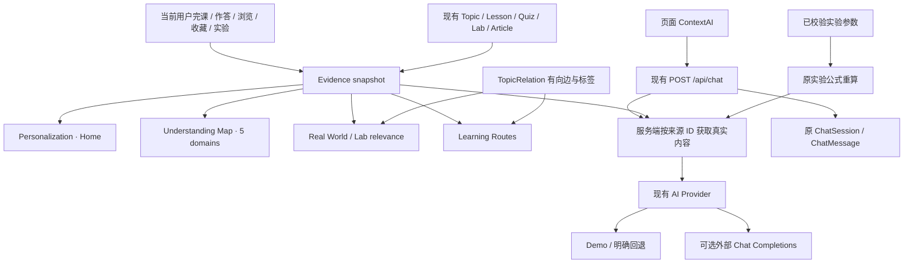

# FinPilot V2 · Architecture

沿用 React + TypeScript / FastAPI / SQLAlchemy / SQLite 单体结构；没有新增依赖、数据库表、字段或迁移。内容和用户活动模型保持 V1；派生证据、个性化和路线在请求时计算，不写回分数。

## 数据流

## 服务职责

| 文件                          | 职责                                                           |
| ----------------------------- | -------------------------------------------------------------- |
| `services/understanding.py`   | 用户隔离的 Evidence snapshot、主题分项、状态、复习列表与五领域 |
| `services/personalization.py` | 聚合 Home：继续学习、下一主题、资料、实验与收藏目标            |
| `services/learning_routes.py` | 确定性 BFS、原始边标签及关系说明                               |
| `services/relevance.py`       | 现有真实来源资料与实验的可解释匹配                             |
| `ai/contextual.py`            | 上下文解析、Demo 材料、实验重算、共享外部适配                  |
| `api/v2.py`                   | V2 薄路由，不复制业务逻辑                                      |

## Evidence 计算

每次仅读取当前 user_id 的 UserProgress、QuizRecord、LabRecord、TopicView、Favorite。游客没有用户活动。内容按稳定 ID / 课程位置排序，作答以记录 ID 最大者作为该题最新结果。

主题的课程覆盖使用 Lesson.topic_ids（缺失时使用主主题）；题目和实验使用其真实主主题映射。Article 浏览/收藏使用其多主题；Topic、Lesson、Lab、Post 收藏解析到现有内容关联。没有内容对象的历史引用跳过。

| 分项       | 默认权重 | 分子 / 分母                           |
| ---------- | -------: | ------------------------------------- |
| lesson     |       40 | 已完成相关课程 / 所有相关课程         |
| quiz       |       35 | 最新答对的不同题目 / 主题全部可用题目 |
| lab        |       15 | 参与过的不同实验 / 主题全部关联实验   |
| engagement |       10 | 有浏览或收藏为 1，否则 0 / 1          |

没有课程、题目或实验时该项权重为零，其余权重重新归一化。分数为 `round(100 × Σ(weight × fraction) / Σ(available weights))`。未答题仍在可用题目分母中，不把“一道题答对”当作整主题满分。

状态按以下顺序判定：≥70 且没有最新仍错的题为 `established`；否则 ≥30 为 `building`；否则存在实际活动为 `exploring`；无活动为 `unexplored`。前端使用 Learning Evidence 和相应中文状态，而非掌握度诊断。

五领域直接由五条 LearningPath 对应课程的主题集合导出，可交叠，不沿用旧六维雷达作为 V2 能力图。卡片汇总接触主题、完课、待复习数；主题面板展示真实分母和可用权重。

复习候选：最新仍错，或有活动且证据 <60。错题优先，然后近期活动、错题数和 ID。回答正确后历史错误不再使该题永久挂在复习区。时间戳仅用于稳定排序，当前时钟和随机数不参与派生计算。

## 个性化与资料关联

继续学习顺序：最近作答/收藏的未完成课 → 最近课程所在路径未完成课 → 最近主题关联未完成课 → Money Basics 未完成课。现有模型没有 lesson-start，界面如实称为推选，不伪造未完成进度。

下一主题沿最近接触主题的真实出边产生，去重并排除已有充分证据的目标，最多三个；每项显示起点与 relation label。资料从 12 条 `REAL_WORLD` 中匹配最近主题及复习主题，先考虑优先主题，再比较直接映射与一跳有向关联，最后 ID。不把 EXPLAINER 冒充外部资料。

资料保留来源、日期与原链接，并给出个人关联原因、涉及主题、已有证据及待探索部分。无真实匹配就返回空数组。实验按同一主题优先序寻找直接/一跳关联；无活动时给明确标记的第一个新手实验，有活动但无关联时返回 null。

## 路线算法

起点先考虑证据 ≥30 的非目标主题（证据、近期、ID 排序），再考虑实际接触主题，最后基础路径目录。对候选逐一 BFS，邻接点和边按 ID 排序：先找有向路径，全部没有时才允许无向连通搜索。

BFS 保证选定起点到目标的最少边数，不宣称全局最短、最优教学顺序或先修体系。逆向经过的边保留原始 from/to/label，并设置 `traversed_reverse`；前端明确显示 Connection Route 与非反向因果。无路径只显示目标和诚实原因。已具充分证据的目标提供复习单节点。

Known 对应 established；Next 为路径中首个尚未达到 established 的节点；Target 为用户所选目标。收藏只保存原 Topic Favorite，不新增路线表；Home 采用最近收藏主题作为目标，路线随着学习证据重算。

## API 契约

| 方法 / 路径                                 | 行为与权限                                               |
| ------------------------------------------- | -------------------------------------------------------- |
| GET `/api/v2/home`                          | 可游客访问，聚合工作台                                   |
| GET `/api/v2/understanding-map`             | 登录后获取自己的证据与建议目标                           |
| GET `/api/v2/learning-routes/{topic_id}`    | 返回 steps、relations、kind、reason，未知 ID 404         |
| GET `/api/v2/topics/{topic_id}/connections` | 实际边、方向、简短解释和课程入口，未知 ID 404            |
| GET `/api/v2/discover/relevant`             | 真实关联资料；游客为空                                   |
| GET `/api/v2/labs/recommended`              | 实际关联或明确新手入口，可为 null                        |
| POST `/api/chat`                            | 保留 V1 输入，增加可选 context；原认证和会话隔离继续生效 |
| GET `/api/search`                           | 保留原结果类别，追加 routes 类别                         |

上下文 `source_type` 限定 topic / lesson / article / lab / relation / route，`source_id` 必须有效；动作白名单；片段最长 1,200 字符并清理 HTML 标签和控制字符；实验参数沿用 LabInput 边界且只允许 Lab 来源。服务端自己加载名称、主题、内容和当前证据，实验结果重算。

Contextual AI 使用同一个 `/chat`、Provider 和会话表。响应元数据保留来源、动作、片段与实验输入，完整 Copilot 追问可继续发送；不增加另一套聊天持久化。外部请求只附当前材料、所需计数、最多 2,500 字符课程片段和最近 10 条消息，不发送账户邮箱、密码散列或全量学习档案。用户输入与片段标为不可信材料。

Demo 基于当前来源和动作生成稳定解释、例子或真实题目入口，不执行自由形式事实验证。External 沿用原环境配置和失败回退；模拟适配器覆盖 live 和 fallback，未验证真实供应商连接。

## 兼容性与运行隔离

V1 ORM、seed、内容、依赖清单、实验公式和 `deploy/` 均未修改。对 V1 SQLite 做只读备份后在 V2 tmp 副本运行 seed 与证据服务：23 张表、289 行和 9 个账户全部保持，见 [兼容报告](v2-compatibility-check.json)。原 V1 API 的 29 个测试全部通过。

V2 本地 Vite 5174 代理 FastAPI 8002，默认 CORS 对应 5174。统一启停脚本仅依据 V2 自己的运行状态与 PID 身份管理进程。没有运行服务器部署脚本；旧站端口和目录不在本轮操作范围。
